Income by Race/Ethnicity, Gender, Parent Income, Commuting Zone
================

This report explores a dataset containing demographic information and other details of children born in the United States from 1978-1983. It contains a group of data tables, with varying numbers of rows and columns, with observations aggregated by parent income percentile rank, child race, gender and commuting zone.

Exploring Data
--------------

### Parent Incomes and Race, Gender, Education, Incarcertain, Child Income

#### Looking at the number of children whose parents fall into a certain income percentile, according to race/ethnicity.

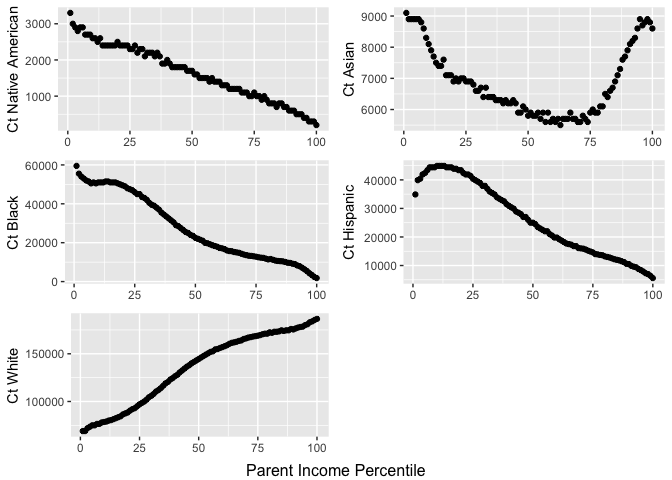

For parents of Native American, Black and Hispanic children, there is a strong linear negative relationship where as the income percentile rank increases, the number of children with parents in that rank decrease. For parents of White children we have the opposite relationship, as income percentile rank increases, the number of children with parents in that rank increase as well. In parents of Asian children we see a bit of a dichotomy, where there are high numbers of children with parents in a low income percentile rank, low numbers in the middle income rankings, and high again in high income percentile rankings.

#### Looking at the density of children whose parents fall into a certain income percentile, according to race/ethnicity.

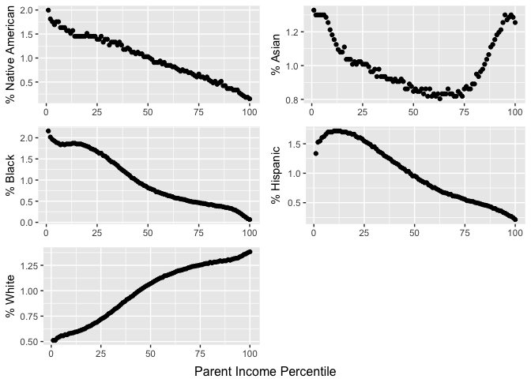

Similarly to the graph before this one looking at the counts, the density of children with Native American, Black and Hispanic parents is higher in the low income percentiles, decreasing as the rankings increase. There is a low percentage of white children with parents in low income rankings, and the density increases as income rankings increase. The same dichotomy we saw earlier in Asian children is the same.

#### College Attendance by Race, Gender and Parents' Income

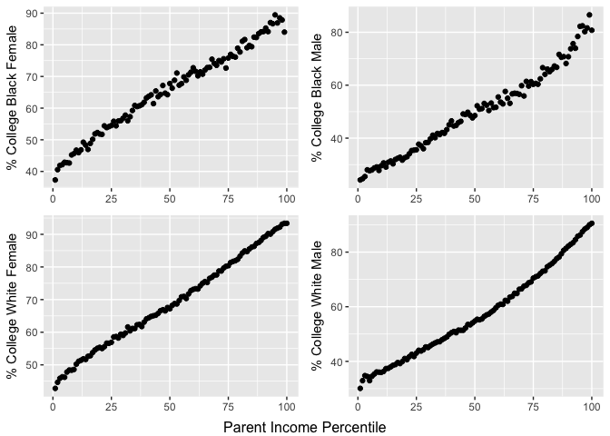

It's clear that regardless of race or gender, parents' income percentile ranking correlates strongly and positively with the childrens' college attendance.

#### Incarceration rates of children by Race, Gender, and Parents' Income

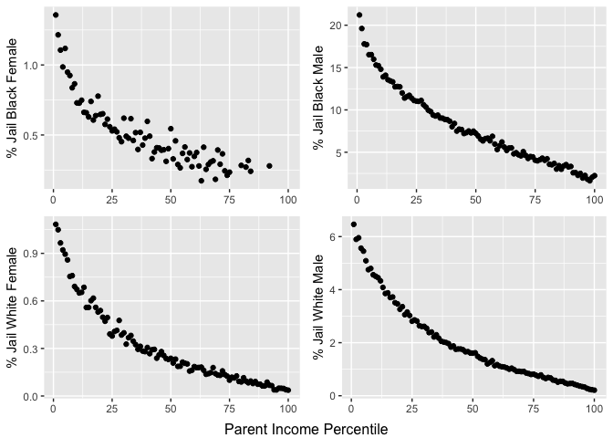

Regardless of race or gender, parents' income percentile ranking correlates somewhat strongly, negatively, and slightly exponentially with childrens' incarceration rates as of April 1, 2010.

#### High School Degree/GED by Race, Gender, and Parents' Income

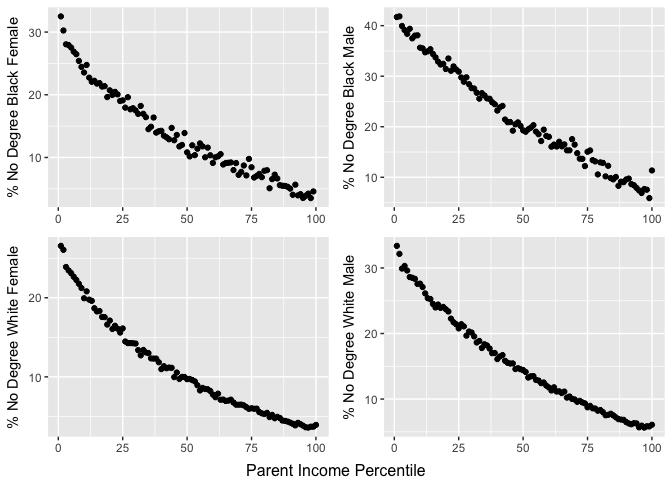

Similar to incarceration rates, low parent income percentile rankings have high percentages of children with no high school diploma or GED at age 19 or older. The percentages of children with no diploma gradually decrease as parent income percentile rankings increase. This applies across the board in race and gender.

#### Mean Wage Rank of Children by Race, Gender and Parents' Income

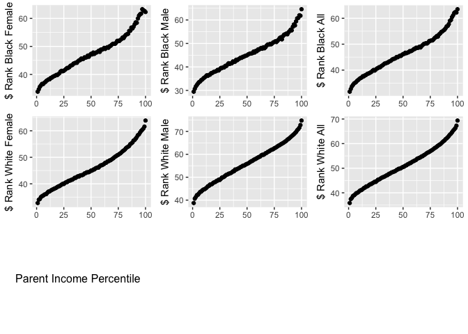

It looks likes parents' income percentile rankings correlate pretty strongly and positively with mean wage rank of children across the board. It just looks like white male children rank slightly higher that black male children for parents with the same income percentile ranking. For example, white males with parents in the 100th percentile seem to on average fall into around the 75th percentile in wages. Black males with parents also in the 100th percentile seem to on average fall into around the 65th percentile in wages.

#### Mean Income Rank for Males by Race, Parents' Income, and Single/Two Parents

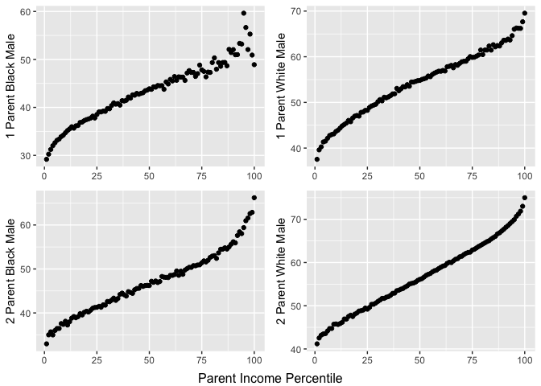

Overall, white males fare slightly better than black males in their average income rankings relative to parents' income rankings. We do see that for both races, having 2 parents home correlates with slightly higher mean wages than having only 1 parent home.

### Race and Gender in Incomes

#### Income Quintiles by Race and Gender

Income quintiles are split evenly into 5; with the 1st quintile being the bottom 20% of the population, the 2nd quintile being the 20-40% of the population, and so on.

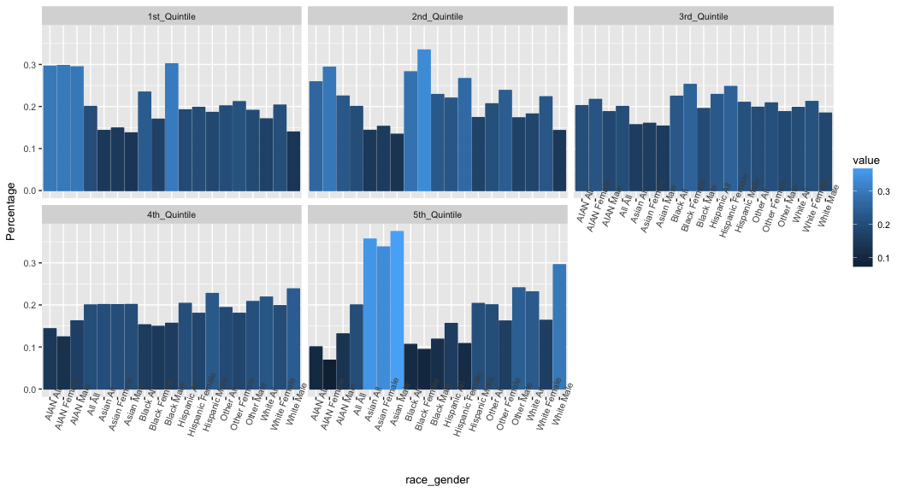

This is interesting. Native Americans or American Indian Alaskan Native (AIAN) and Black Males make up the highest proportions of the first quintile of incomes. When we get to the fifth quintile, aka the highest 20% of individual income, we see those of Asian background make up the highest proportions.

#### Parent Income Quintiles by Race and Gender

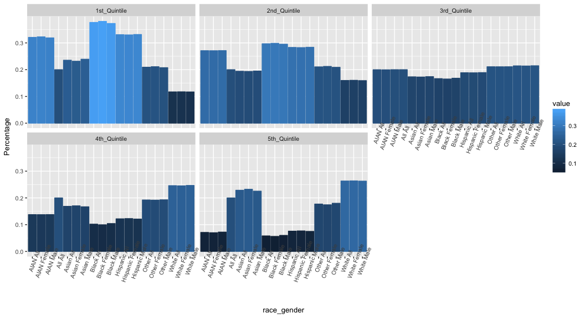

This too is interesting. Black parents make up the largest proportion of the bottom 20% of incomes. Once we get to the top 20% of incomes, white parents make up the highest proportions. When comparing to the previous faceted plot of individual income quintiles, we see that Black children are faring better than their parents, with black males only faring slightly better. We also see that Asian children are faring much better than their parents, and white females are faring worse than their parents.

#### Child Income Quintiles Compared with Parent Quintiles by Race and Gender

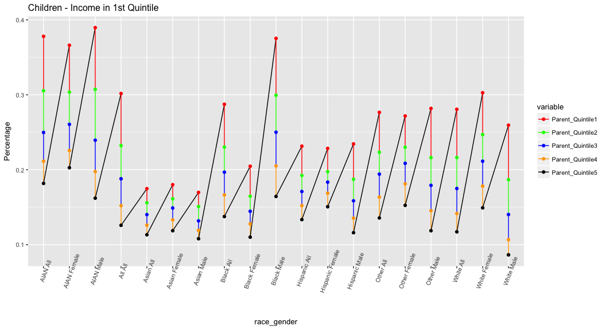

For children who wind up landing an income in the first quintile, we don't see much of a trend from the income quintile their parents fell in.

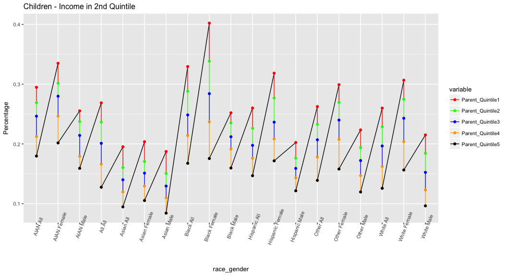

Children who fall into the 2nd quintile of income similarly pretty much follow suit with the income quintile their parents were/are in.

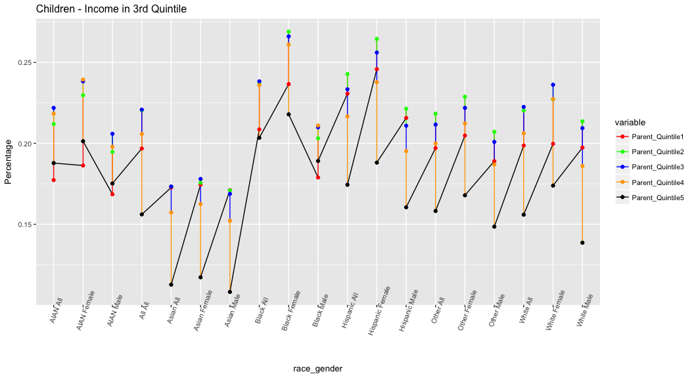 This is where things get interesting. We're starting to see children less and less following suit with their parents' incomes. Let's see if this trend intensifies.

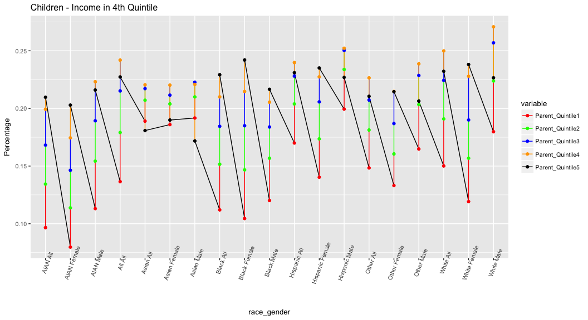

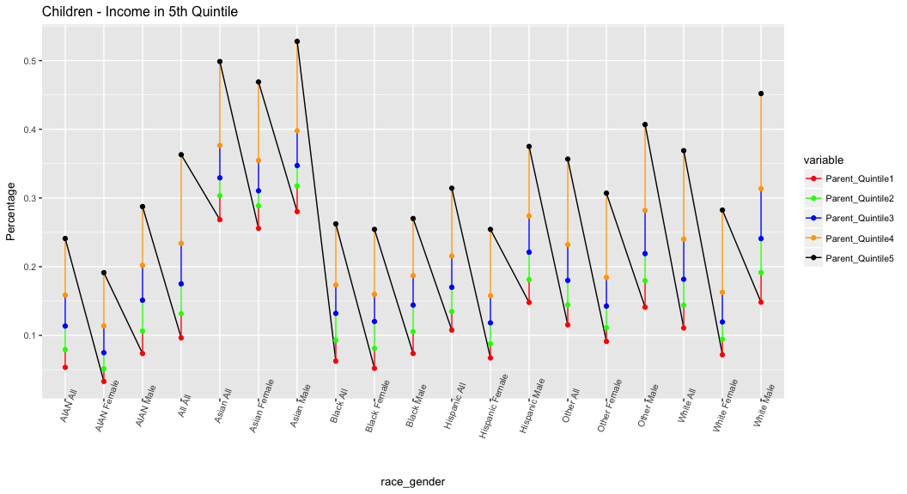

### Reflections

There are some interesting trends observed in this data story. We see that Black, Hispanic, and Native American parents have the lowest incomes. We also see that parental income appears to correlate quite strongly with high school graduation rates, college attendance rates, and incarceration rates (negative correlation). Having both parents home also appears to coincide with slightly higher child incomes. However, this could have more to do with the family income being higher as a result of a dual income household moreso than the support of two parents rather than one.

When it comes to child incomes(once they grow up of course), there are some notable differences across racial/ethnic lines where we see those of Asian background taking the highest proportions of those in the top 20% of income (5th quintile). When comparing child incomes to the quintile their parents fell in, there are some differences. We see a bit of stagnancy in parent income quintile and child income quintile in native americans who don't appear to be faring much better than parents.

Very interesting notes here for further research.
